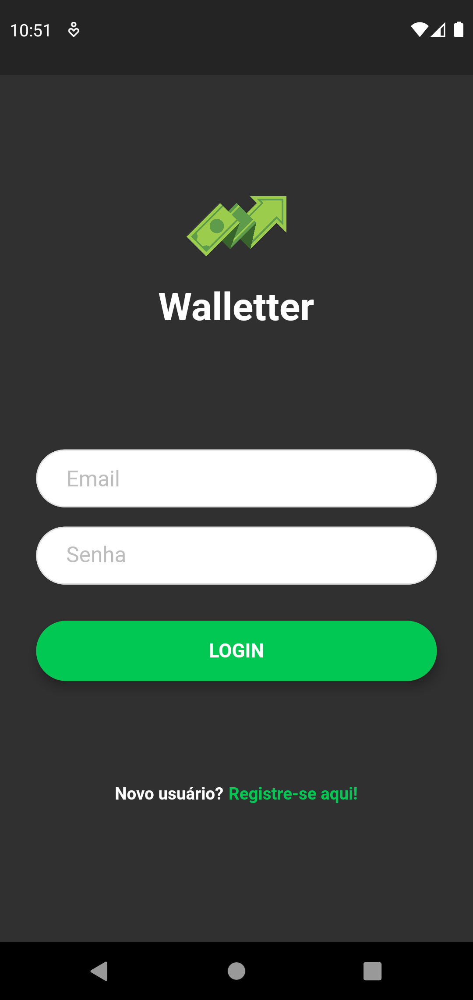
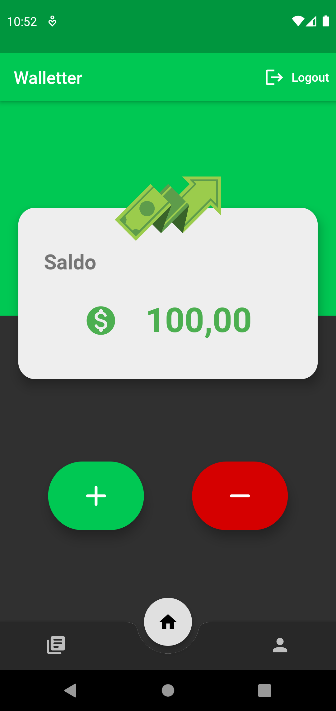
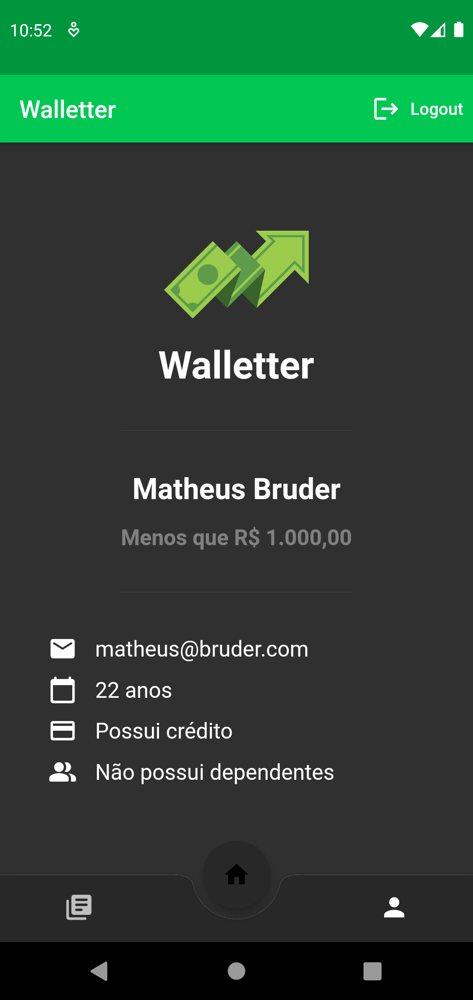

# Walletter

<!---Esses são exemplos. Veja https://shields.io para outras pessoas ou para personalizar este conjunto de escudos. Você pode querer incluir dependências, status do projeto e informações de licença aqui--->

> Este projeto foi desenvolvido durante a disciplina de Dispositivos Móveis (SI700) da Faculdade de Tecnologia da Unicamp. O objetivo foi desenvolver um app financeiro, ou seja, a finalidade do Walletter é auxiliar o controle financeiros dos usuários da maneira mais fácil e intuitiva possível.

## Ajustes e melhorias

Os requisitos básicos para o projeto já foram desenvolvidos, contudo as próximas atualizações serão voltadas nas seguintes tarefas:

- [x] Interface gráfica
- [x] BLOC
- [x] Autenticação via firebase
- [x] Banco de dados (Firestore)
- [ ] Inserir gráfico
- [ ] Visualização mensal

## 💻 Pré-requisitos

Antes de começar, verifique se você atendeu aos seguintes requisitos:
<!--- Estes são apenas requisitos de exemplo. Adicionar, duplicar ou remover conforme necessário --->
- Você instalou a versão mais recente de `Flutter`.
- Você instalou algum emulador ou conectou seu celular Android.

## ☕ Usando Walletter

Para usar Walletter, siga estas etapas:

1. Abra o simulador ou seu celular Android.
2. Execute o arquivo `main.dart`.
3. Faça seu registro / login.
4. Use o app da maneira que preferir.

## 📫 Contribuindo para Walletter
<!---Se o seu README for longo ou se você tiver algum processo ou etapas específicas que deseja que os contribuidores sigam, considere a criação de um arquivo CONTRIBUTING.md separado--->
Para contribuir com Walletter, siga estas etapas:

1. Bifurque este repositório.
2. Crie um branch: `git checkout -b <nome_branch>`.
3. Faça suas alterações e confirme-as: `git commit -m '<mensagem_commit>'`.
4. Envie para o branch original: `git push origin <nome_do_projeto> / <local>`.
5. Crie a solicitação de pull.

Como alternativa, consulte a documentação do GitHub em [como criar uma solicitação pull](https://help.github.com/en/github/collaborating-with-issues-and-pull-requests/creating-a-pull-request).

## 📝 Licença

Esse projeto está sob licença. Veja o arquivo [LICENÇA](LICENSE) para mais detalhes.

[⬆ Voltar ao topo](#Walletter) 
